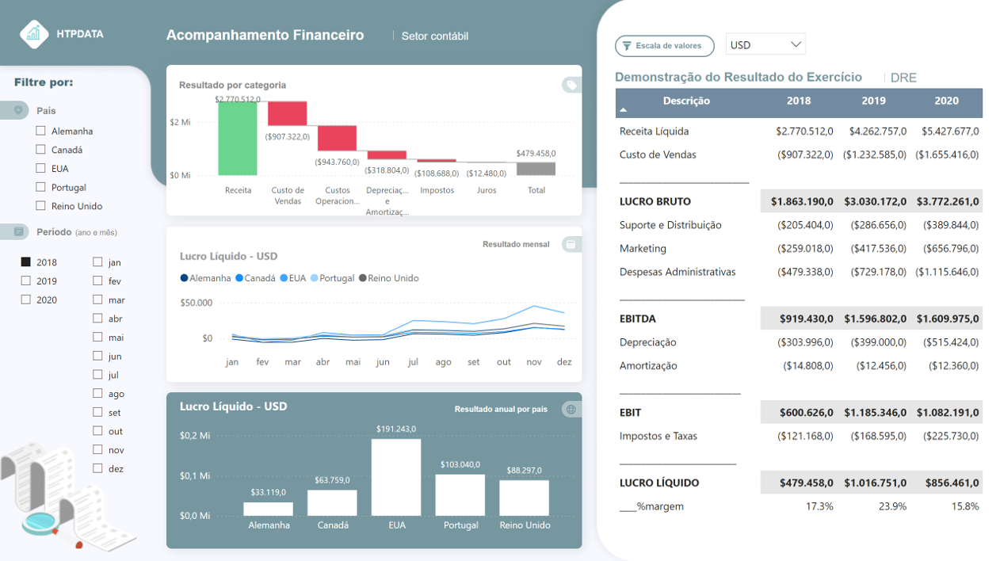
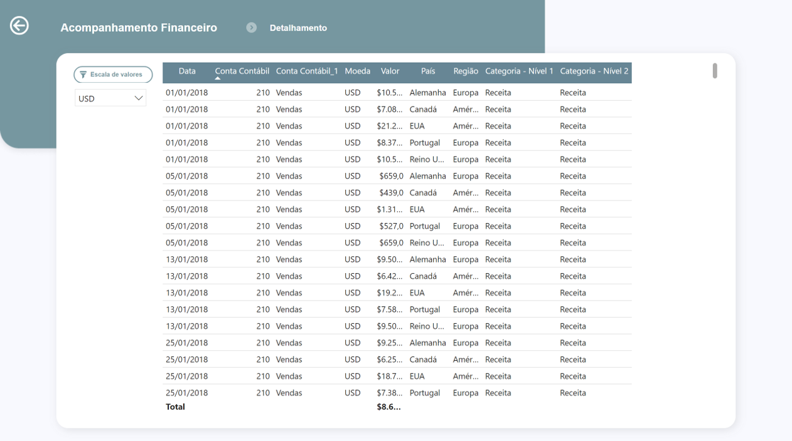
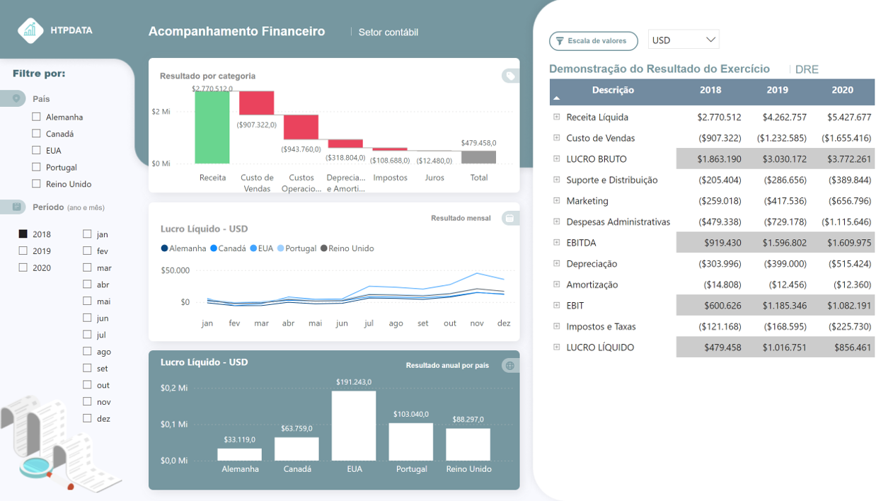

# Acompanhamento Financeiro - Demonstração do Resultado do Exercício (DRE)

  

## 🎯 Sobre o Projeto

Este projeto desenvolve um **dashboard interativo em Power BI** para análise financeira da **Demonstração do Resultado do Exercício (DRE)**. O sistema foi criado para substituir o controle manual em planilhas Excel, proporcionando análises dinâmicas e insights estratégicos para apresentação a investidores.

## 🖼️ Visualizações do Dashboard

### DRE Consolidada



### Detalhamento



### DRE Consolidada - Nível 2



## 🌐 Dashboard Online

[](https://app.powerbi.com/view?r=eyJrIjoiODk3MTNlYzMtNjdhOC00OTc0LTk5NjYtNzU1Yjk4NjdiYTY3IiwidCI6IjdlYmVmODBjLTEwMjctNDEyOS1iNDg0LWNjZjJiZDNmZDU4ZiJ9&pageName=ReportSectionc55e3165497e16cde238)

## 💡 Insights e Benefícios

- Estrutura automatizada da DRE, eliminando esforços manuais em planilhas

- Comparativo financeiro entre os anos de 2018, 2019 e 2020

- Waterfall Chart para visualização clara de receitas, custos e margens

- Análises por país/região com filtros dinâmicos

- Conversão de valores em USD e K USD (milhares)

- Base sólida para reuniões com investidores e stakeholders

## 📁 Estrutura do Projeto

```text
📁 acompanhamento_financeiro_dre_powerbi/
├── 📁 data/                              
│   └── raw/                                              # Dados brutos                                               
│      └── db_dre.xlsx                             
│ 
├── 📁 reports/                                           # Relatórios e análises
│   ├── powerbi/                                         
│   │   └── link_dashboard _financeiro_dre_v1.txt.txt         
│   └── exports/                                           # Arquivos exportados
│       └── images/
│           ├── slide1.png                                 # Capturas de Tela
│           ├── slide2_detalhamento.png 
│           └── slide3_nvl2.png                      
│
└── 📄 README.md                                           # Documentação do projeto
```

## 🛠️ Tecnologias Utilizadas

- **Excel**: Fonte de dados estruturada (db_dre.xlsx)
- **Power Query**: ETL (Extract, Transform, Load) e transformação de dados
- **Power BI Desktop**: Desenvolvimento do dashboard e modelagem de dados
- **DAX (Data Analysis Expressions)**: Criação de medidas calculadas e KPIs
- **Power BI Service**: Publicação e compartilhamento online do dashboard
